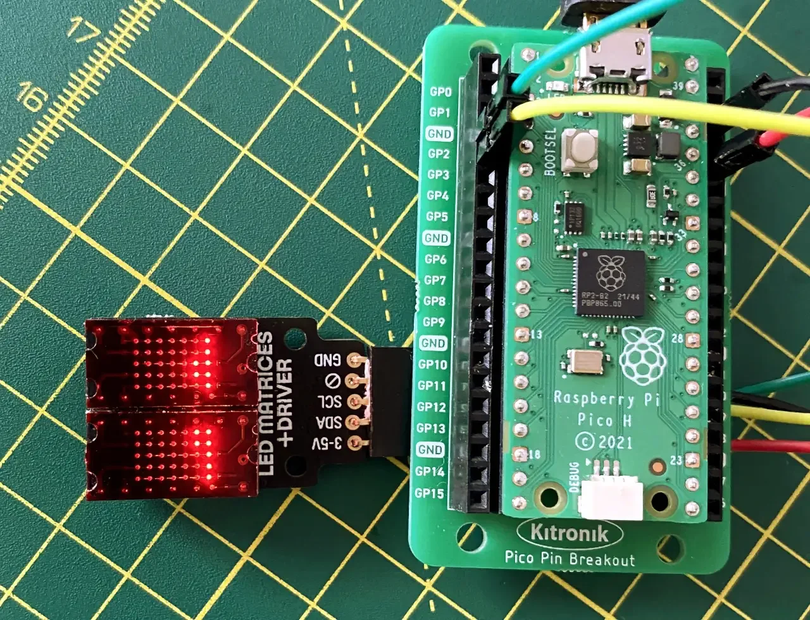
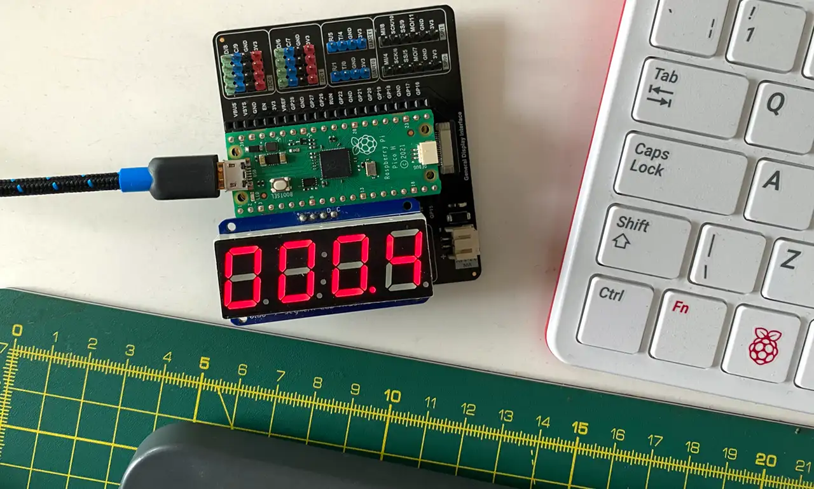

# Depot 1.3.0

Multi-bus clients for macOS and Linux, and bus-host adaptor board firmware for the RP2040.

It is used as the basis for I&sup2;C client apps for generic I&sup2;C usage, and to operate Holtek HT16K33-controlled matrix and segment LED displays, and 1-Wire apps for generic 1-Wire usage and to use the Analog Devices DS18B20 sensors.



The client code is largely written in C, and will compile and run on both macOS and Linux. The exceptions are the DS18B20 command-line utility and DS18B20 GUI app, both of which are written in Swift — and the latter is built for the macOS GUI.

Why Depot? Because it’s a place in which you’ll find lots of buses.

**Note** This repo supersedes and extends [cli2c](https://github.com/smittytone/cli2c), the previous repo for this code, now archived. However, Depot maintains the older repo’s versioning.

## Hardware Requirements

### Bus Host Board

The bus host board is a [Raspberry Pi Pico](https://www.raspberrypi.com/documentation/microcontrollers/raspberry-pi-pico.html), [Adafruit QTPy RP2040](https://www.adafruit.com/product/4900), [Adafruit QT2040 Trinkey](https://www.adafruit.com/product/5056), [SparkFun ProMicro RP2040](https://www.sparkfun.com/products/18288), [Pimoroni Tiny 2040](https://shop.pimoroni.com/products/tiny-2040?variant=39560012234835) or [Arduino Nano RP2040 Connect](https://store.arduino.cc/products/arduino-nano-rp2040-connect-with-headers).

It runs the included firmware and connects to a host computer via USB.


From version 1.2.2, the build system will use the standard Pico SDK environment variable `PICO_BOARD`, if set, to configure compilation for a particular supported board. If the variable is undefined, or set to a board not yet supported by Depot, the firmware will be built for all supported boards.

| Board | `PICO_BOARD` Value |
| :-- | :-- |
| Pico | `pico` |
| QTPy | `adafruit_qtpy_rp2040` |
| ProMicro | `sparkfun_promicro` |
| Tiny | `pimoroni_tiny2040` |
| Trinkey | `adafruit_trinkey_qt2040` |
| Nano | `arduino_nano_rp2040_connect` |

* There’s more information [in this blog post](https://blog.smittytone.net/2023/03/16/meet-depot-an-rp2040-based-multi-bus-adaptor-for-macs-and-linux-pcs/).

## Build the Client Apps

#### macOS

You can build the code from the accompanying Xcode project files:

* `cli2c.xcodeproj` — Contains `cli2c`. `segment` and `matrix`.
* `cliwire.xcodeproj` — Contains `cliwire`, `ds18b20` and `sensor` (GUI).

In each case:

1. Archive the project.
1. Save the build products on the desktop.
1. Copy the binary artifacts to your preferred location listed in `$PATH`.

#### Linux

1. Navigate to the repo directory.
1. `cd linux`
1. `cmake -S . -B build -D`
1. `cmake --build build`
1. Copy the binary artifacts to your preferred location listed in `$PATH`.

## Build and Deploy the Bus Host Firmware

**Important** WE STRONGLY RECOMMEND YOU BUILD THE FIRMWARE WITH PICO SDK 1.5.0 OR ABOVE.

1. Navigate to the repo directory.
1. Optionally enter `export PICO_BOARD=x`, where x is a board name ([see above](#bus-host-board)).
1. `cmake -S . -B firmwarebuild`
1. `cmake --build firmwarebuild`
1. Write the firmware depending on which board you are using:
    * `./deploy.sh /path/to/device firmwarebuild/firmware/pico/firmware_pico_rp2040.uf2`
    * `./deploy.sh /path/to/device firmwarebuild/firmware/qtpy/firmware_qtpy_rp2040.uf2`
    * `./deploy.sh /path/to/device firmwarebuild/firmware/promicro/firmware_promicro.uf2`
    * `./deploy.sh /path/to/device firmwarebuild/firmware/tiny/firmware_tiny2040.uf2`
    * `./deploy.sh /path/to/device firmwarebuild/firmware/trinkey/firmware_trinkey2040.uf2`
    * `./deploy.sh /path/to/device firmwarebuild/firmware/nano/firmware_arduino_nano.uf2.uf2`

The deploy script tricks the RP2040-based board into booting into disk mode, then copies over the newly build firmware. When the copy completes, the RP2040 automatically reboots. This saves of a lot of tedious power-cycling with the BOOT button held down.

#### Debug vs Release

You can switch between build types when you make the `cmake` call in step 2, above. A debug build is made by default, but you can make this explicit with

```shell
cmake -S . -B firmwarebuild -D CMAKE_BUILD_TYPE=Debug
```

For a release build, which among various optimisations omits UART debugging code, call:

```shell
cmake -S . -B firmwarebuild -D CMAKE_BUILD_TYPE=Release
```

Follow both of these commands with the usual

```shell
cmake --build firmwarebuild
```

## What’s What

The contents of this repo are:

```
/depot
|
|___/client                         // Client-side code, written in C
|   |___/cli2c                      // A generic CLI tool for any I&sup2;C device
|   |___/matrix                     // An HT16K33 8x8 matrix-oriented version of cli2c
|   |___/segment                    // An HT16K33 4-digit, 7-segment-oriented version of cli2c
|   |___/cliwire                    // A generic CLI tool for any 1-Wire device
|   |___/common                     // Code common to all versions
|   |___/i2c                        // I2C driver code
|   |___/onewire                    // 1-Wire driver code
|   |___/ds18b20                    // A DS18B20-oriented version of cliwire
|   |___/sensor                     // A macOS GUI app the uses the 1-Wire and serial driver code.
|
|___/firmware                       // The RP2040 host firmware, written in C
|   |___/pico                       // The Raspberry Pi Pico version
|   |___/nano                       // An Arduino Nano RP2040 Connect version
|   |___/promicro                   // A SparkFun ProMicro RP2040 version
|   |___/qtpy                       // An Adafruit QTPy RP2040 version
|   |___/tiny                       // A Pimoroni Tiny 2040 version
|   |___/trinkey                    // An Adafruit QT2040 Trinkey version
|   |___/common                     // Code common to all versions
|
|___/examples                       // Demo apps
|   |___cpu_chart_matrix.py         // CPU utilization display for 8x8 matrix LEDs
|   |___cpu_chart_segment.py        // CPU utilization display for 4-digit segment LEDs
|   |___cpu_chart_ltp305_cli2c.py   // CPU utilization display for twin LTP305 matrices
|   |___mcp9809_temp.py             // Periodic temperature reports from an MCP9808 sensor
|
|___/linux                          // Linux build settings (Cmake) for the client apps
|
|___CMakeLists.txt                  // Top-level firmware project CMake config file
|___pico_sdk_import.cmake           // Raspberry Pi Pico SDK CMake import script
|
|___firmware.code-workspace         // Visual Studio Code workspace for the RP2040 firmware
|___cli2c.xcodeproj                 // Xcode project for cli2c, matrix and segment
|___cliwire.xcodeproj               // Xcode project for cliwire
|
|___deploy.sh                       // A .uf2 deployment script that saves pressing
|                                   // RESET/BOOTSEL buttons.
|
|___README.md
|___LICENSE.md
```

## Devices

Under macOS, RP2040-based boards will appear in `/dev` as `cu.usbmodemXXXXX` or `cpu_chart_ltp305_cli2c.py`. You can use my [`dlist()`](https://blog.smittytone.net/2022/09/08/how-to-manage-serial-devices-on-mac/) shell function to save looking up and keying in these names, which can vary across boots.

Under Linux, specifically Raspberry Pi OS, boards appear as `/dev/ttyACM0`. You may need to add your user account to the group `dialout` in order to access the port:

1. Run `sudo adduser smitty dialout`
1. Log out and then back in again.

## Client Apps

The following client apps are included in the repo. They are documented [on my documentation site](https://smittytone.net/docs/depot_i2c.html).

| App | Description | Platform | Docs |
| --- | --- | --- | --- |
| `cli2c` | A command line utility for generic I&sup2;C use | macOS, Linux | [Link](https://smittytone.net/docs/depot_i2c.html#cli2c) |
| `matrix` | A specific driver for HT16K33-based 8x8 LED matrices | macOS, Linux | [Link](https://smittytone.net/docs/depot_i2c.html#matrix) |
| `segment` | A specific driver for HT16K33-based 4-digit, 7-segment LEDs | macOS, Linux | [Link](https://smittytone.net/docs/depot_i2c.html#segment) |
| `cliwire` | A generic 1-Wire command line utility | macOS, Linux | [Link](https://smittytone.net/docs/depot_1wire.html#cliwire) |

## Full Examples

The [`examples`](examples/) folder contains Python scripts that make use the above apps.

* `cpu_chart_matrix.py` — A rudimentary side-scrolling CPU activity chart. Requires an HT16K33-based 8x8 matrix LED.
* `cpu_chart_segment.py` — A CPU activity numerical percentage readout. Requires an HT16K33-based 4-digit, 7-segment matrix LED.
* `mcp9809_temp_cli2c.py` — Second-by-second temperature readout. Requires an MCP98008 temperature sensor breakout.
* `cpu_chart_ltp305_cli2c.py` — A version of the side-scrolling CPU activity chart. Requires a [Pimoroni LED Matrices + Driver](https://shop.pimoroni.com/products/led-dot-matrix-breakout).

All the examples run at the command line and take the path to the adaptor device as a required argument and a I&sup2;C address as a second, optional address (if you are not using each device’s standard address). For example:

```shell
python examples/cpu_chart_ltp305_cli2c.py /dev/cu.usbserial-0101 0x63
```



## Acknowledgements

This work was inspired by James Bowman’s ([@jamesbowman](https://github.com/jamesbowman)) [`i2ccl` tool](https://github.com/jamesbowman/i2cdriver), which was written as a macOS/Linux/Windows command line tool to connect to his [I2CMini board](https://i2cdriver.com/mini.html).

My own I&sup2;C driver code started out based on James’ but involves numerous changes and (I think) improvements. I also removed the Windows code removed and some unneeded functionality that I don’t need (I&sup2;C capture, monitoring). Finally, it targets fresh firmware I wrote from the ground up to run on an RP2040-based board, not the I2CMini.

Why? Originally I was writing an HT16K33 driver based directly on James’ code, but I accidentally broke the pins off my I2CMini — only to find it is very hard to find new ones. James’ firmware is written in a modern version of Forth, so I can no choice but to learn Forth, or write code of my own. I chose the latter.

Thanks are also due to Hermann Stamm-Wilbrandt ([@Hermann-SW](https://github.com/Hermann-SW)) for the basis for the [deploy script](#deploy-the-firmware).

The 1-Wire driver is based on code I produced for the Twilio Electric Imp IoT platform some years ago.

## Release Notes

- 1.3.0 *Unreleased*
    - Add button support to firmware.
    - Add `buttons` app.
    - Build a Linux version of `ds18b20`.
    - Remove some delays on UART-over-USB comms.
- 1.2.2 *23 April 2023*
    - Support the Pico SDK’s `PICO_BOARD` environment variable to select specific firmware targets.
    - Support the Arduino Nano RP2040 Connect.
- 1.2.1 *21 March 2023*
    - Add LTP305 LED matrix example.
    - Add example instructions.
- 1.2.0 *17 March 2023*
    - Rename project to `Depot`.
    - Add 1-Wire support to adaptor firmware.
    - Add 1-Wire centric client apps: `cliwire` for generic use, `ds18b20` to read a single DS18B20 sensor, `sensor` to read a single DS18B20 sensor and display the output in a GUI.
    - Use CMake’s `CMAKE_BUILD_TYPE` variable to choose build types when building at the command line.
    - Migrate client app documentation from Read Me to my documentation site.
    - Remove early debug code outputting to a connected segment display.

*You can find release notes for previous versions [here](https://github.com/smittytone/cli2c)*

## Licences and Copyright

All client apps are © 2023 Tony Smith (@smittytone) and licensed under the terms of the MIT Licence.

The RP2040 firmware is © 2023, Tony Smith (@smittytone). It is licensed under the terms of the MIT Licence.
